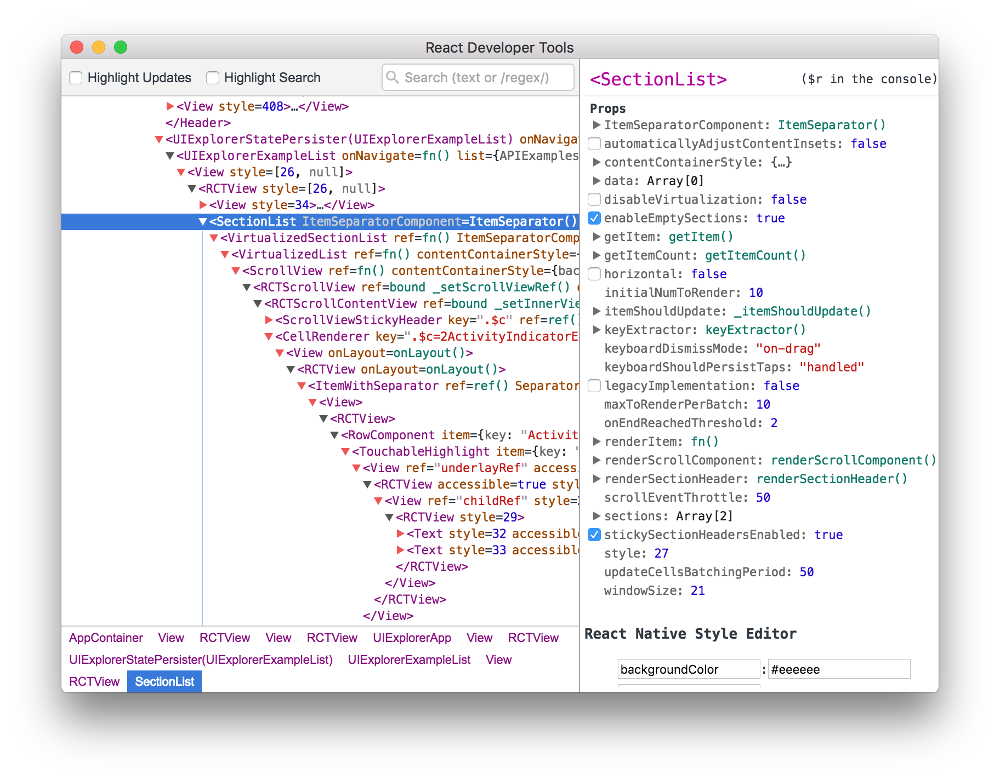

import Tabs from '@theme/Tabs'; import TabItem from '@theme/TabItem'; import constants from '@site/core/TabsConstants';

你可以使用[独立版 React 开发者工具(不是 chrome 的插件)](https://github.com/facebook/react/tree/main/packages/react-devtools)来调试 React 组件层次结构。要使用它，请全局安装`react-devtools`包:

> 注意：react-devtools v4 需要 react-native 0.62 或更高版本才能正常工作。

<Tabs groupId="package-manager" defaultValue={constants.defaultPackageManager} values={constants.packageManagers}>
<TabItem value="npm">

```shell
npm install -g react-devtools
```

</TabItem>
<TabItem value="yarn">

```shell
yarn global add react-devtools
```

</TabItem>
</Tabs>

> 译注：react-devtools 依赖于 electron，而 electron 需要到国外服务器下载二进制包，所以国内用户这一步很可能会卡住。此时请在`环境变量`中添加 electron 专用的国内镜像源：`ELECTRON_MIRROR="https://npm.taobao.org/mirrors/electron/"`，然后再尝试安装 react-devtools。

安装完成后在命令行中执行`react-devtools`即可启动此工具：

```
react-devtools
```



很快就能连上模拟器。

> 提示：如果你不想全局安装`react-devtools`，可以把它单独加入项目中。用`npm install --save-dev react-devtools`命令把`react-devtools`包安装到你的项目中，并在`package.json`的`scripts`中添加 `"react-devtools": "react-devtools"`，接着在项目根目录下运行`npm run react-devtools`命令即可。

:::info
If connecting to the emulator proves troublesome (especially Android 12), try running `adb reverse tcp:8097 tcp:8097` in a new terminal.
:::

:::info
If you prefer to avoid global installations, you can add `react-devtools` as a project dependency. Add the `react-devtools` package to your project using `npm install --save-dev react-devtools`, then add `"react-devtools": "react-devtools"` to the `scripts` section in your `package.json`, and then run `npm run react-devtools` from your project folder to open the DevTools.
:::

## Integration with React Native Inspector

Open the Dev Menu and choose "Toggle Inspector". It will bring up an overlay that lets you tap on any UI element and see information about it:


However, when `react-devtools` is running, Inspector will enter a collapsed mode, and instead use the DevTools as primary UI. In this mode, clicking on something in the simulator will bring up the relevant components in the DevTools:


You can choose "Toggle Inspector" in the same menu to exit this mode.

## Inspecting Component Instances

When debugging JavaScript in Chrome, you can inspect the props and state of the React components in the browser console.

First, follow the instructions for debugging in Chrome to open the Chrome console.

Make sure that the dropdown in the top left corner of the Chrome console says `debuggerWorker.js`. **This step is essential.**

Then select a React component in React DevTools. There is a search box at the top that helps you find one by name. As soon as you select it, it will be available as `$r` in the Chrome console, letting you inspect its props, state, and instance properties.


## Debugging application state

[Reactotron](https://github.com/infinitered/reactotron) is an open-source desktop app that allows you to inspect Redux or MobX-State-Tree application state as well as view custom logs, run custom commands such as resetting state, store and restore state snapshots, and other helpful debugging features for React Native apps.

You can view installation instructions [in the README](https://github.com/infinitered/reactotron). If you're using Expo, here is an article detailing [how to install on Expo](https://shift.infinite.red/start-using-reactotron-in-your-expo-project-today-in-3-easy-steps-a03d11032a7a).
